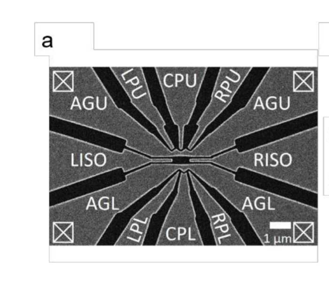

# Review-of-Quantum-Dot

## [Ge/Si quantum wires for quantum computing](https://www.nature.com/articles/s41578-020-00262-z)

### Rebirth of Germanium
- Maturity in technology for Ge compatible high K dielectric- Essential for better conduction	
- Heterogeneous integration of Ge on Si within a conventional CMOS process bypasses the need to develop Ge substrates at prohibitive manufacturing costs 
- Highest Hole mobility at room temperature.
- Quantum Confined holes provide scope for spin, tological state qubits and gatemons.

#### Imp hole properties in Ge (Key for fast electrical spin qubit control)
- Tunable g-factors and hence tunable spin-orbit coupling
- Low effective mass implies Less curvature(d2E/d2K) hence large energy level spacing
- Long hole spin lifetime - as holes are in p valence band so are more diffused hence hyperfine interactions are very weak.

#### Other hole properties
- A low schottky barrier(Energy barrier between valence band edge and fermi energy of metal) enables contacts to superconductors with low barrier.
- Low Fermi level in germanium allows easy creation of holes without any doping.

### Heavy hole and Light hole

#### Bulk Ge

- For valence state, l = 1(p-type) s =½; j=3/2(has 4 degenerate eigenstates 3/2, ½, -½, -3/2 and energy Vso/2) and j=½(has 2 degenerate eigenstates and energy -Vso). So delV = 0.3 eV in Ge hence are more energetically separated. 
- Luttinger Kohn Hamiltonian has a coupled term k.J. (k is crystal momentum). 

- In heavy holes, J has the projection(=3/2) along direction of motion i.e k. Hence higher energy
- In light holes, J has the projection of(=½) and hence lower energy

#### Planar Heterostructures(Quasi 2D system)

- In Ge/SiGe heterostructures, holes are confined to strained Ge layer because of Valence band offset(When two semiconductors are brought together due to difference in vacuum energy, they develop offset both in CB and VB. Due to this barrier the Ge holes are confined to the Ge layers.)
- Holes are confined in z direction(Stacked between Si layers). So k can be estimated as k^2 = kx^2 + ky^2. 
- Basis states with Jz = 3/2 form heavy hole state while Jz = ½ form light hole state. The heavy hole state have eff mass m = 0.05m0 and light hole state have eff mass m = 0.125 m0
- Low mass of heavy hole(primarily with Jz = 3/2) statesin the valence band  implying large curvature leads to  large orbital level spacing useful for spin qubits.

#### Hutwires
- Confined strongly out of the plane in z dir.
- Low energy holes are purely heavy holes (Why). 

#### Nanowires
- Eff mass can be varied according to the thickness of Si shell.
- Small eff mass(large curvature of E-k) is useful for Spin qubits
- Large eff mass implies large e-e interaction important for majorana modes.
- Large mixing of HH-LH as they are highly confined so very few energy states are available.

### Spin Orbin Interaction
#### Rashba Effect
- Splitting of energy states based on spin in the presence of Electric field that is momentum dependent.
- Occurs due to the breaking of inversion symmetry(an asymmetric potential(created due to E field) perpendicular to the 2D plane) and spin-orbit coupling.
- DRSOI requires HH-LH mixing and hence is more prominent in Nanowires then hutwires. The importance of this effect is that we are able to perform rapid spin qubit rotations using electric dipole spin resonance(EDSR) which is essential for spintronics devices.

### Decoherence-time 
- As p orbital are far away so hyperfine interactions are suppressed.
- Charge noise can be present. So the qubit must be confined where DRSOI is minimum. So that when we turn off the external E field, the qubit can be isolated.
- Phonon noise are suppressed due to inversion symmetry of Si and Ge(How?)

### Quantum Dots-
- Constrained systems with low hole occupation number that is tunable. Current through QD can be influenced by spin effects.
- Coloumb Blockade Oscillation - At low enough temperatures and small bias voltage, the energy cost to add an extra electron onto the island may exceed the thermal energy (kBT  << e^2/Capacitance) and the current through the island is blocked. This is the Coulomb blockade effect.
- In nanowires, g-factor is very small along NW axis while SO interactions are high along perpendicular direction i.e. g-factor is anisotropic.

#### Spin qubits
- Spin relaxation is the relaxation of a system to ground state from excited state. In our case we are considering relaxation through spin flip processes.As spin effects influence current through QD we can mesure spin relaxation time.
- In Si, as SO interaction is small so they require nanomagnets while in Ge the SO splitting is large so Ge enables us to scale the system as we dont require external field. For realization of spin qubits we have to increase the number of qubits and scale it to 2D structure.
- The spin coherence/lifetime can be measured using the Rabi oscillations.
- Pauli Spin Blockade - Pauli spin blockade is a way to measure spin in QD by means of charge(Not possible for 1D QD). In this case, when we bias drain w.r.t source and Energy of QD-1 and QD-2 is lower than drain then for same aligned electron blocks the passage of current through the DQD. (ref: [Video](https://www.youtube.com/watch?time_continue=876&v=RGoETtK2YCE&embeds_euri=https%3A%2F%2Fwww.google.com%2Fsearch%3Fclient%3Dsafari%26rls%3Den%26q%3Dpauli%2Bspin%2Bbloackage%26ie%3DUTF-8%26oe%3DUTF-8&source_ve_path=MTM5MTE3LDEzOTExNw&feature=emb_logo&themeRefresh=1))
- Pauli spin blockade can be imposed by putting appropriate gate voltage and when we apply microwave of hf = g u B then current increases which implies qubit rotation
#### Superconductor-Semiconductor hybrids(S-Sm)
- When a Sm is brought close to S, then due to superconducting proximity effect, the Sm develops behavior like josephson junction. This are called JoFET.
- Fermi energy of certain supercondutors are close to valence band energy of Ge i.e. low barrier.

Ge is appealing for topological quantum computing as it enables for topologically protected quasiparticle states.
Ge has high SO interaction and hence RSOC provides an intrinsic mechanism for electrical qubit control.
Also provides the platform for development of logical qubits in 2D structure. Schottky barrier free contacts.

## [Quantum Dots](https://iopscience.iop.org/article/10.1088/1361-6528/ab061e)
Ref: [link](https://github.com/rockysaikia730/Review-of-Quantum-Dot/edit/main/README.md/SimulateQD.pdf)

### Quantum Dot(Q1)
- It has SiGe substrate on which Ge is strained between another layer of SiGe. 
- A layer of Al2O3 has been stacked and Sn and Au is stacked to form the gate.
- Electron beam lithography was used using a single metal layer.
- Four ohmic contacts are used for measurement.
- The effective mass of the hole is around 0.08mo implying greater spatial extent and hence tunnel couplings would be enhanced.
- The SEM image of the 2DHG confinement to hole.

 

- The plunger gates were used to tune the size of the quantum dot.
- The accumulation gate were negatively biased in order to accumulate the holes. It had a threshold voltage -0.4 V to -1.6V.
- The plungers are biased positively for confinement.

## Simulation

- An attempt was made from my side to develop the structure in COMSOL and calculate the charge density uing Thomas Fermi approximation
- Non availability of data is making it difficult to replicate it. 

